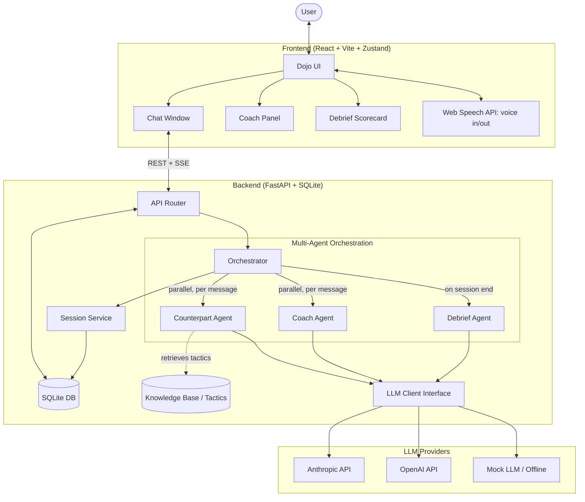

# 🥋 Negotiation Dojo

Negotiation Dojo is an Agentic AI sparring environment for practicing high-stakes negotiations such as salary discussions, insurance claims, and rent renewals. It features an adversarial Counterpart agent, real-time Coach feedback, and a Debrief scorecard after every session.

## Architecture



## Workflow

User input (scenario + goal) → Counterpart Agent → Coach Agent → negotiation loop → Debrief Agent → performance scorecard.

1. The user picks a domain, difficulty, goal and context.
2. The Counterpart opens and negotiates using domain-specific tactics.
3. For every user message, the Counterpart reply and the Coach analysis run in parallel.
4. The loop ends on a deal, a walk-away, or when the user ends the session.
5. The Debrief Agent scores the full transcript and the result is saved to history.

## Quick start

```bash
# Backend
cd backend
python -m venv .venv && source .venv/bin/activate
pip install -r requirements.txt
cp .env.example .env          # set LLM_PROVIDER=mock to run without an API key
uvicorn app.main:app --reload --port 8000

# Frontend (new terminal)
cd frontend
npm install
cp .env.example .env
npm run dev                   # http://localhost:5173
```

Or run both with Docker: `docker compose up --build`

## API overview

| Method | Path | Purpose |
|---|---|---|
| GET | /api/health | Health check |
| GET | /api/domains | List negotiation domains |
| POST | /api/sessions | Start a session |
| POST | /api/sessions/{id}/messages | Send a message (SSE stream) |
| POST | /api/sessions/{id}/end | Run the Debrief Agent |
| GET | /api/sessions/{id} | Full transcript and scorecard |
| GET | /api/history | Past sessions |
| GET | /api/history/stats | Averages, trend, suggested difficulty |

## Project structure

See `backend/README.md` and `frontend/README.md` for each part.